# 🤖 Azure AI Foundry — Agent Tracing & Evaluation Walkthrough

**Presenter:** Sahil Nagpal  
**Date:** June 24, 2026  
**Project:** `first-project` | Azure AI Foundry (`learnitsahilaif`)  
**Agent:** MCP-My-New-Agent (GitHub MCP Integration)

---

## Overview

This document walks through the end-to-end setup of **Agent Tracing** and **Agent Evaluation** on Azure AI Foundry. The agent (`MCP-My-New-Agent`) connects to the GitHub MCP server to answer user queries about repositories and code. We instrumented it with Application Insights for full observability, then ran a structured evaluation using auto-generated rubrics against production traces.

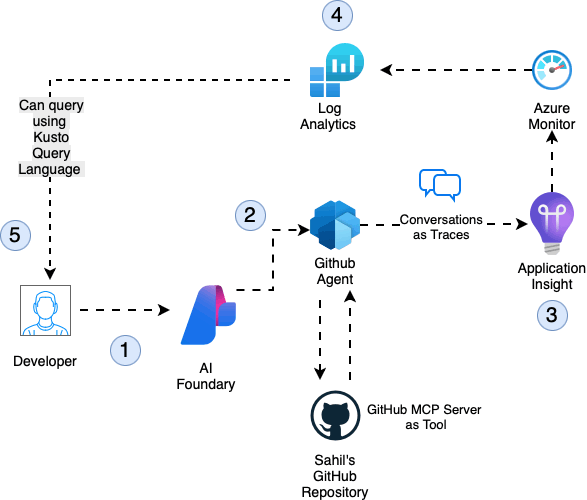

---

## Step 1 — Provision All Required Azure Resources

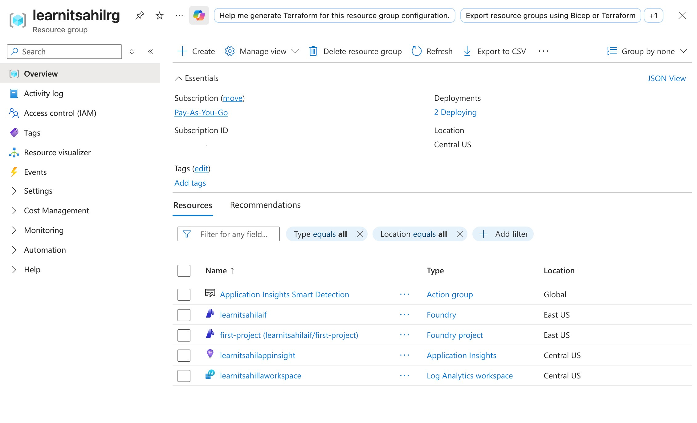

### What Was Done
Before any agent work begins, the right Azure infrastructure needs to be in place. In the resource group `learnitsahilrg` (subscription: Pay-As-You-Go, region: Central US / East US), the following resources were provisioned:

| Resource | Type | Purpose |
|---|---|---|
| `learnitsahilaif` | Azure AI Foundry | Host the agent project |
| `first-project` | Foundry Project | Workspace for agents, evaluations, data |
| `learnitsahilappinsight` | Application Insights | Capture agent traces and telemetry |
| `learnitsahillaworkspace` | Log Analytics Workspace | Backend store for App Insights logs |
| Application Insights Smart Detection | Action Group | Automated anomaly alerting |

### Why This Matters
Application Insights and Log Analytics must exist **before** tracing is connected to the agent. The Log Analytics Workspace is the underlying data store — App Insights is the query and visualization layer on top. Getting this right at the start avoids needing to retrofit observability later.

---

## Step 2 — Create the Agent in Azure AI Foundry

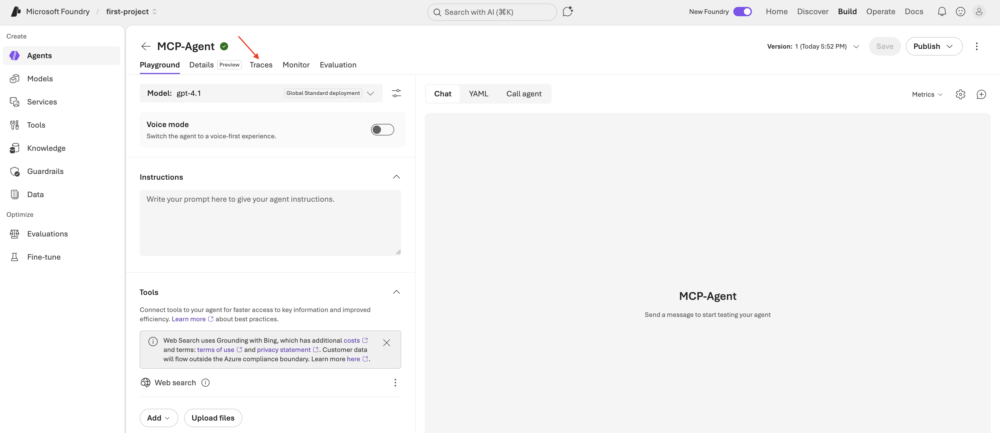

### What Was Done
Inside the `first-project` Foundry project, a new agent called **MCP-Agent** was created (later versioned as MCP-My-New-Agent). Key configuration:

- **Model:** `gpt-4.1` (Global Standard deployment)
- **Tool connected:** Web Search (Grounding with Bing)
- **Instructions:** System prompt defining the agent's purpose
- **Interface tabs available:** Playground, Details, Traces, Monitor, Evaluation

### What to Note
The `Traces` tab shown in the top nav is where all agent conversation traces will appear once Application Insights is connected. At this stage, the agent exists but tracing is **not yet enabled** — that's done in the next steps. The `Publish` button in the top right is used to version the agent after changes.

---

## Step 3 — Connect Application Insights for Tracing

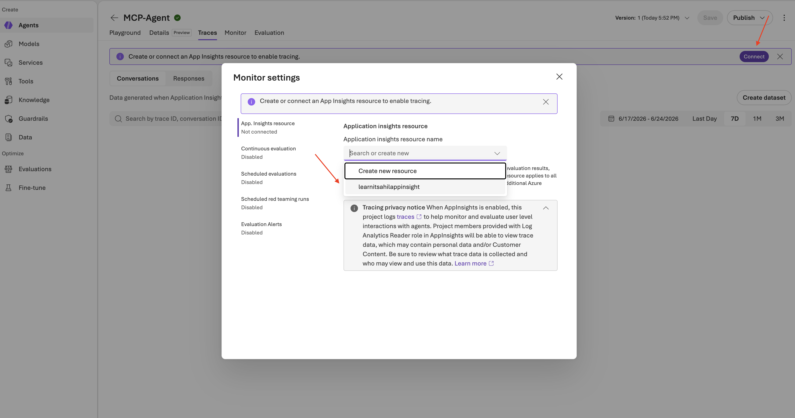

### What Was Done
Under the agent's **Traces** tab, the "Connect" button was clicked to open **Monitor Settings**. From the dropdown, the existing Application Insights resource `learnitsahilappinsight` was selected (rather than creating a new one).

### What to Note
- The modal shows a **Tracing Privacy Notice** — once App Insights is enabled, the project logs all traces including user-level interactions. Team members with Log Analytics Reader role can view this data.
- The dropdown shows both options: "Create new resource" and the existing `learnitsahilappinsight` — the existing one was selected to reuse the already-provisioned resource from Step 1.
- This single connection applies tracing to **all agents** in the project, not just MCP-Agent.

---

## Step 4 — Fetch App Insights Connection String via Code

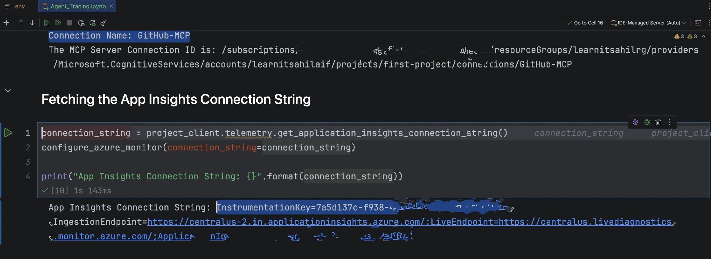

### What Was Done
In the Jupyter notebook (`Agent_Tracing.ipynb`), the Azure AI Projects SDK was used to programmatically fetch the Application Insights connection string and configure the Azure Monitor exporter:

```python
connection_string = project_client.telemetry.get_application_insights_connection_string()
configure_azure_monitor(connection_string=connection_string)
```

This also confirmed the **GitHub MCP Server connection** is registered in the Foundry project at the path:
```
/subscriptions/.../resourceGroups/learnitsahilrg/providers/
Microsoft.CognitiveServices/accounts/learnitsahilaif/
projects/first-project/connections/GitHub-MCP
```

### What to Note
The `configure_azure_monitor()` call is what instruments the Python runtime to send OpenTelemetry traces to App Insights. Without this, the SDK calls happen but nothing is captured in the telemetry pipeline. The connection string includes the `InstrumentationKey`, `IngestionEndpoint`, and `ApplicationId` — all auto-fetched from the Foundry project, so no manual copy-pasting of keys.

---

## Step 5 — Retrieve the Application Insights Instrumentation Key

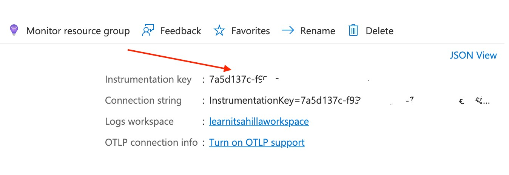

### What Was Done
In the Azure Portal, the `learnitsahilappinsight` Application Insights resource was opened to confirm the key details:

- **Instrumentation Key:** `7a5d137c-****`
- **Logs Workspace:** `learnitsahillaworkspace` (confirming the LA workspace linkage)
- **OTLP Connection:** Available but not yet turned on — standard ingestion used instead

### What to Note
This step is a **verification checkpoint** — confirming the instrumentation key shown in the portal matches what the SDK fetched programmatically in Step 4. The Log Analytics workspace link confirms traces will be queryable via KQL in the Logs blade.

---

## Step 6 — Enable Tracing in Foundry (Portal UI — Step 1)

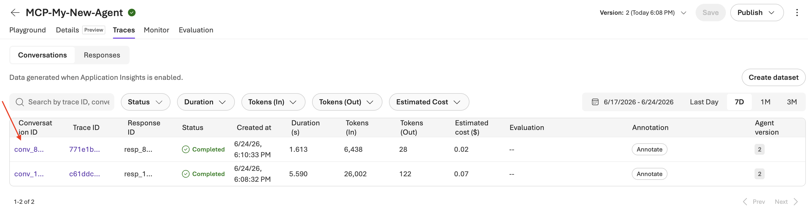

### What Was Done
Back in the Foundry agent's **Traces** tab, the tracing connection banner appeared at the top: *"Create or connect an App Insights resource to enable tracing."* The **Connect** button on the right was clicked to open Monitor Settings — this is the portal UI path to the same configuration done via the SDK in Steps 4 and 5.

---

## Step 7 — Enable Tracing in Foundry (Portal UI — Step 2 — Select Resource)

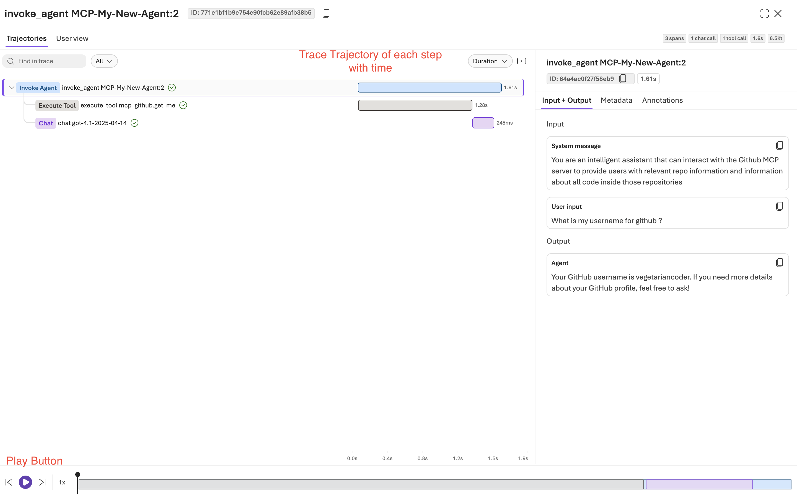

### What Was Done
Inside the Monitor Settings modal, the Application Insights resource dropdown was opened and `learnitsahilappinsight` was selected from the list. This completes the portal-side tracing setup.

### What to Note
The Monitor Settings panel on the left also shows other capabilities that are currently **Disabled** but available to enable:
- **Continuous evaluation** — automatically evaluate every conversation in production
- **Scheduled evaluations** — run evaluations on a cron schedule
- **Scheduled red teaming runs** — automated adversarial testing
- **Evaluation alerts** — notify when evaluation scores drop below thresholds

These are the next logical steps after getting baseline tracing working — particularly continuous evaluation for a production RAG chatbot.

---

## Step 8 — Verify Traces Flowing into Application Insights

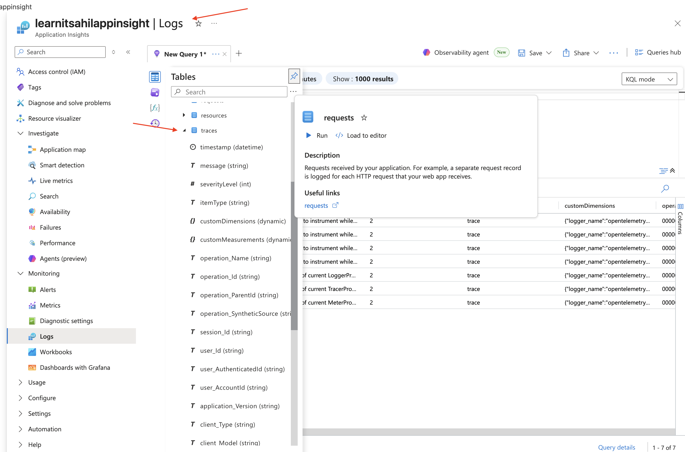

### What Was Done
In the Azure Portal, the `learnitsahilappinsight` **Logs** blade was opened and the `traces` table was queried. The results confirmed that telemetry was flowing — rows were appearing with:

- `message` (string) — the trace message content
- `severityLevel` (int) — log severity
- `customDimensions` (dynamic) — structured metadata including `logger_name: opentelemetry`
- `operation_Name`, `operation_Id`, `operation_ParentId` — distributed tracing correlation fields
- `session_Id`, `user_Id`, `user_AuthenticatedId` — user-level tracking fields

### What to Note
The `customDimensions` column showing `logger_name: opentelemetry` confirms the Azure Monitor OpenTelemetry exporter configured in Step 4 is working correctly. The `traces` table is the raw ingestion table — for richer agent-specific views, the Foundry portal's Traces tab (which wraps these same logs) is more convenient. The `requests` table visible in the schema panel captures HTTP-level calls.

---

## Step 9 — Create a New Evaluation

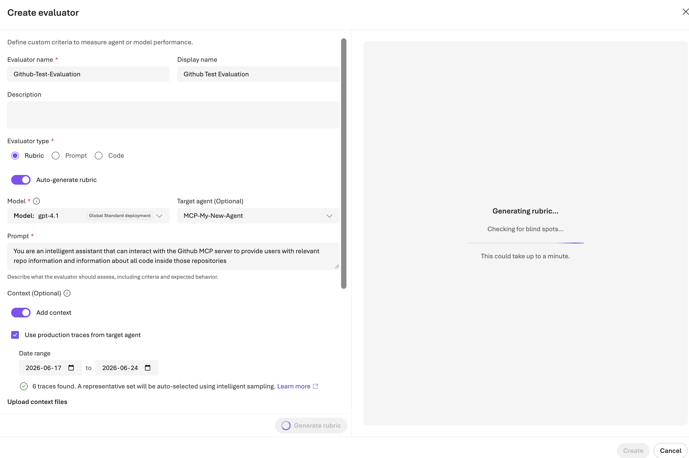

### What Was Done
In the Foundry project under **Evaluations → Create new evaluation**, the evaluation target was configured:

- **Target type:** Agent (not Model or Dataset)
- **Agent selected:** `MCP-My-New-Agent` — **Version 2** specifically
- The evaluation wizard shows 5 steps: Target → Scope → Data → Criteria → Review

### What to Note
Selecting **Agent** as the target type (rather than Model) is important — it evaluates the full agent loop including tool calls, MCP server interactions, and response generation. Selecting a specific **version** (v2) is also significant — this means evaluation results are tied to that exact agent configuration, making it possible to compare v2 vs v3 performance after prompt or tool changes. Version `MCP-Agent v3` is visible but not selected here.

---

## Step 10 — Auto-Generate Evaluation Rubric

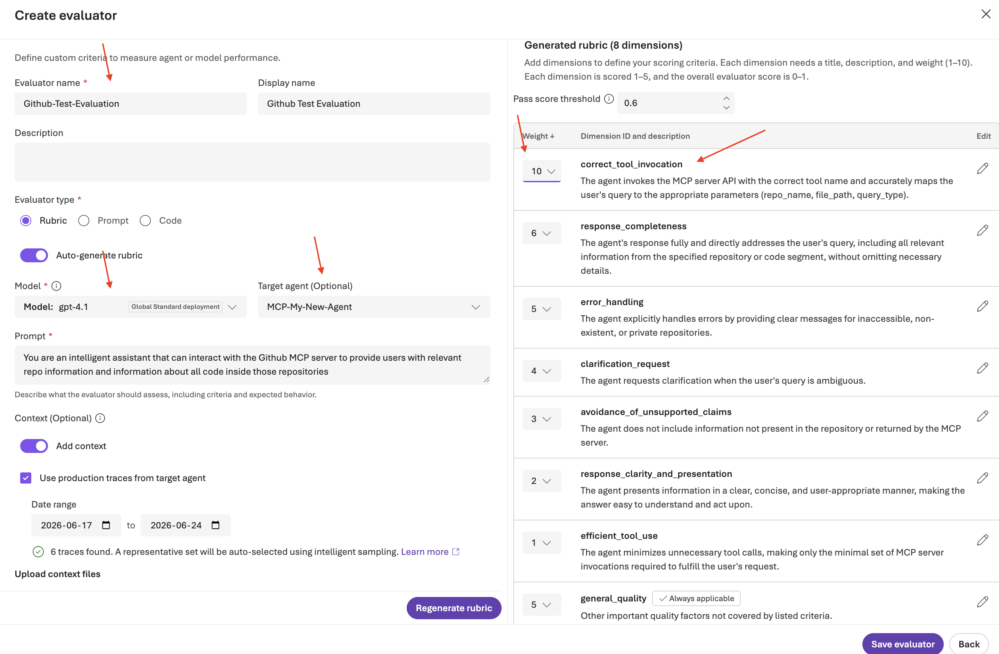

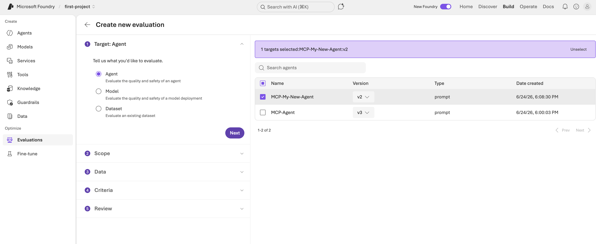

### What Was Done
A custom evaluator called **Github-Test-Evaluation** was created using the **Rubric** evaluator type with **Auto-generate rubric** enabled. Configuration:

- **Model:** `gpt-4.1` (Global Standard deployment) — used to score responses
- **Target agent:** `MCP-My-New-Agent`
- **Prompt:** *"You are an intelligent assistant that can interact with the Github MCP server to provide users with relevant repo information and information about all code inside those repositories"*
- **Context:** Production traces from the target agent, date range `2026-06-17` to `2026-06-24`
- **Traces found:** 6 traces — a representative set auto-selected via intelligent sampling

The auto-generated rubric produced **8 scoring dimensions**:

| Dimension | Weight | Description |
|---|---|---|
| `correct_tool_invocation` | 10 | Agent calls the MCP server with correct tool name and parameters |
| `response_completeness` | 6 | Response fully addresses the user query without omissions |
| `error_handling` | 5 | Agent handles inaccessible/non-existent repos gracefully |
| `clarification_request` | 4 | Agent asks for clarification when query is ambiguous |
| `avoidance_of_unsupported_claims` | 3 | Agent doesn't hallucinate info not in the repository |
| `response_clarity_and_presentation` | 2 | Response is clear and easy to act on |
| `efficient_tool_use` | 1 | Agent minimizes unnecessary MCP server calls |
| `general_quality` | 5 | Catch-all for other quality factors |

**Pass score threshold:** 0.6

### What to Note
The rubric was **generated automatically** by GPT-4.1 analyzing the agent's system prompt and production traces — this is a significant productivity win. The weights reflect what matters most for a GitHub MCP agent: correct tool invocation (weight 10) is the most critical, followed by completeness (6). The rubric is fully editable before saving.

---

## Step 11 — Run the Evaluation

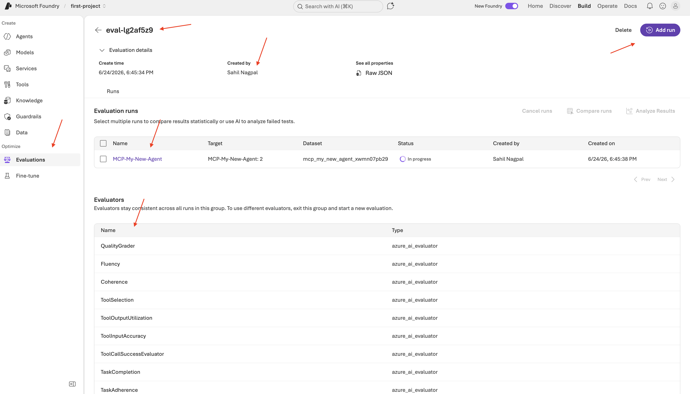

### What Was Done
The evaluation `eval-lg2af5z9` was created and an evaluation run was kicked off against `MCP-My-New-Agent: version 2`. The run detail page shows:

- **Run name:** MCP-My-New-Agent
- **Target:** MCP-My-New-Agent: 2
- **Dataset:** `mcp_my_new_agent_xwmn07pb29`
- **Status:** In Progress
- **Created by:** Sahil Nagpal

Below the run, the full list of **Evaluators** applied to this run is visible — all of type `azure_ai_evaluator`:

`QualityGrader`, `Fluency`, `Coherence`, `ToolSelection`, `ToolOutputUtilization`, `ToolInputAccuracy`, `ToolCallSuccessEvaluator`, `TaskCompletion`, `TaskAdherence`

### What to Note
The evaluator list combines **built-in Azure AI evaluators** (Fluency, Coherence) with **agent-specific tool evaluators** (ToolSelection, ToolInputAccuracy, ToolCallSuccessEvaluator) — the latter are particularly important for MCP-based agents where tool calling accuracy is a primary quality signal. The `Add run` button in the top right allows adding more runs to compare against the same evaluator set.

---

## Step 12 — Trace Trajectory View


### What Was Done
Clicking into an individual trace in the Traces tab opens the **Trace Trajectory** view for `invoke_agent MCP-My-New-Agent:2`. This shows the full execution timeline:

```
Invoke Agent  (1.61s total)
  └── Execute Tool  →  mcp_github.get_me  (1.28s)
  └── Chat           →  chat gpt-4.1-2025-04-14  (245ms)
```

The right panel shows the **Input + Output** for the selected span:

- **System message:** *"You are an intelligent assistant that can interact with the Github MCP server..."*
- **User input:** *"What is my username for github?"*
- **Agent output:** *"Your GitHub username is vegetariancoder. If you need more details about your GitHub profile, feel free to ask!"*

### What to Note
The trajectory view is extremely valuable for debugging agent behaviour. You can see:
- The agent correctly routed to `mcp_github.get_me` — the right tool for this query
- Tool execution took **1.28s** (the majority of response time)
- LLM synthesis of the tool output was only **245ms**
- Total end-to-end was **1.61s** — well within acceptable latency
- The playback controls at the bottom allow stepping through the trace frame by frame

---

## Step 13 — Auto-Generated Evaluation Dataset

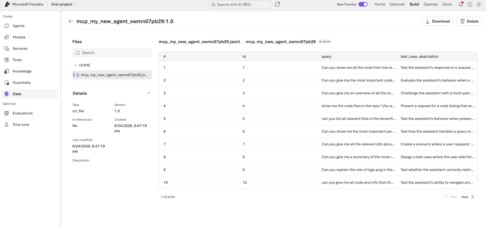

### What Was Done
After the evaluation ran, a dataset `mcp_my_new_agent_xwmn07pb29` was auto-generated and stored under the **Data** section of the Foundry project. The dataset contains **81 test cases** (showing 1-10 of 81), each with:

- `id` — unique identifier
- `query` — the test question sent to the agent
- `test_case_description` — what scenario/behaviour this test case is evaluating

Sample queries from the dataset:

| # | Query (truncated) | Test Description (truncated) |
|---|---|---|
| 1 | Can you show me all the code from the re... | Test the assistant's response to a request... |
| 4 | show me the code files in the repo "city-w... | Present a request for a code listing that ex... |
| 9 | Can you explain the role of logo.png in the... | Test whether the assistant correctly restri... |

### What to Note
The dataset was automatically generated from the production traces collected via App Insights — this closes the loop on the entire pipeline: **trace → dataset → evaluation**. The 81 test cases represent a comprehensive set of query types and edge cases synthesized by GPT-4.1 from real agent interactions. This dataset is now reusable for future evaluation runs as the agent evolves.

---

## End-to-End Architecture Summary

```
GitHub MCP Server
        │
        ▼
Azure AI Foundry Agent (MCP-My-New-Agent)
        │
        ├── OpenTelemetry (configure_azure_monitor)
        │         │
        │         ▼
        │   Application Insights (learnitsahilappinsight)
        │         │
        │         ▼
        │   Log Analytics Workspace (learnitsahillaworkspace)
        │
        └── Foundry Traces Tab
                  │
                  ├── Trace Trajectory View (per conversation)
                  │
                  └── Create Dataset → Auto-generated test cases (81)
                            │
                            ▼
                    Evaluation Run (eval-lg2af5z9)
                            │
                            ├── Rubric Evaluator (8 dimensions, GPT-4.1 judge)
                            └── Built-in Evaluators (Fluency, Coherence, Tool*)
```

---

## Key Takeaways

- **Tracing is a one-time setup** — connect App Insights once at the project level and all agents are covered
- **Auto-generate rubric** is a powerful starting point — GPT-4.1 reads your agent prompt and production traces to create domain-specific scoring criteria automatically
- **Production traces → evaluation datasets** closes the loop between real usage and systematic testing
- **Tool-specific evaluators** (`ToolSelection`, `ToolInputAccuracy`, `ToolCallSuccessEvaluator`) are essential for MCP agents — standard LLM quality metrics alone don't capture tool-calling correctness
- **Version-pinned evaluations** allow A/B comparison between agent versions as the system evolves
